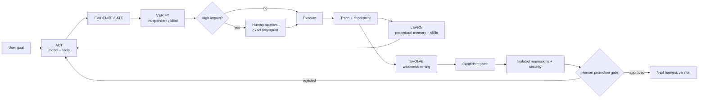

# Adaptive Agent Harness

A model-agnostic reference harness for long-lived AI agents that can research, scrape, code, operate tools, advise, and improve their own harness **without being allowed to silently rewrite the live system**.

The design target is not “maximum autonomy”. It is **maximum useful autonomy under measurable evidence, bounded capabilities, independent verification, durable state, and human-governed self-evolution**.

> Status: frontier reference implementation, 17 August 2026. The core is executable and currently passes **54/54 reference tests**. v0.3 adds a sparse, cost-aware hierarchical team runtime rather than enabling a full-broadcast swarm by default; production hardening targets remain explicitly separated from what is already implemented.

## The four loops



The loops are deliberately separated:

1. **Act** — solve the task with the smallest sufficient set of tools/capabilities.
2. **Verify** — gather evidence before commitment and independently reconstruct/check high-impact actions.
3. **Learn** — externalize reusable procedural knowledge into memory/skills instead of endlessly growing the prompt.
4. **Evolve** — mine traces for repeatable weaknesses, propose one minimal patch, test it in isolation, then require human promotion.

## What is implemented

- **Model gateway:** LiteLLM-backed provider normalization. Use OpenRouter, Replicate, OpenAI-compatible endpoints, Anthropic, Gemini, Ollama, etc. without coupling the harness core to one model vendor. Native tool calling is preferred, but a strict JSON text-tool protocol can be forced for text-only models. Per-role timeout/retry/fallback configuration provides provider failover.
- **Role separation:** primary actor, optional advisory planner, verifier, critic, and optional cheap-worker model slots. The planner is executed before the actor and its provider-reported cost is charged to the same run budget; it cannot grant capabilities. Planner failure degrades safely rather than taking down the actor.
- **Task-family routing:** deterministic generic/code/research/scraping/operations/advisory profiles select strategy, tool subsets, risk ceilings, and model tier while remaining below the same immutable capability policy. An explicit profile can be selected for reproducible evals.
- **Action approvals:** externally visible or privileged actions stop, persist a checkpoint, and generate an exact SHA-256 action fingerprint. Approval is valid only for that exact action.
- **Channel gateway + Telegram:** transport-neutral human sessions sit outside the agent runtime. The Telegram reference adapter is default-deny, allowlisted, uses durable long polling, and surfaces exact action approvals as inline buttons without bypassing the runtime gates.
- **Durable resume:** an approved/rejected action can resume a run without regenerating the pending action.
- **Evidence gate:** pre-commit requirements can block writes/side effects until explicit evidence is present.
- **Blind verifier:** RETRACE-inspired two-stage check reconstructs the apparent goal from a proposed high-impact action *without seeing the original goal*, then compares the reconstruction with the real goal.
- **Provenance-aware observations:** public web and MCP outputs are tagged `UNTRUSTED_EXTERNAL` and injected as data, never as higher-priority instructions.
- **Safe-ish public HTTP primitive:** private/loopback/link-local destinations are rejected, redirects are revalidated, and responses are bounded. Production should still enforce network egress at infrastructure level.
- **Sandbox execution:** Docker, no network, all Linux capabilities dropped, read-only container root, PID/CPU/RAM limits, no implicit image pulls.
- **MCP 2026-07-28 adapter:** stateless per-request protocol metadata, required HTTP routing headers, namespacing, pagination, MRTR surfacing, and **default-deny import**: a remote MCP tool is invisible until a local risk/scope policy explicitly authorizes it.
- **Layered memory:** episodic traces are separate from procedural memory. Interactive sessions can persist bounded conversation context, while procedural knowledge lives separately. SQLite reference adapters can be replaced by Postgres/vector retrieval.
- **File-backed skills:** versionable `SKILL.md` packages are retrieved only when relevant and stay advisory to policy.
- **Sparse hierarchical team runtime:** the parent can invoke `team_orchestrate` for genuinely decomposable work. A lead planner builds a dependency DAG, independent specialists execute in parallel, a synthesizer evaluates evidence and can reopen only targeted gaps for another round. A deterministic complexity gate avoids spending any model tokens on obviously simple requests.
- **Cost-aware worker routing:** workers start on the cheap role when justified, but routing is learned from the harness's own success/cost traces by task family and difficulty bucket. Critical work stays on the primary tier; weak cheap-model performance causes future escalation without changing prompts.
- **Vector work cache:** verified exact work can be reused directly; very-high-similarity verified stable work may be reused semantically; lower-similarity or unverified results become hints only. Volatile/web-derived results are never eligible for semantic direct reuse. Cache keys are isolated by workspace fingerprint and TTL/freshness class.
- **Context capsules + sparse communication:** each specialist receives only the root goal, its bounded subtask, constraints, relevant dependency summaries, and an optional prior analogue. It does not receive every peer transcript. This avoids the token multiplication of broadcast MoA topologies.
- **Read-only specialist execution:** team workers can inspect and execute inside a disposable Docker copy of the workspace, but the host checkout is mounted read-only and the child registry excludes host-write tools. The parent remains the only normal authority for real writes and side effects.
- **Conditional delegation:** direct parallel child delegation remains available for simple breadth-first fan-out; `team_orchestrate` is the stronger plan→parallel work→synthesis→targeted follow-up loop for complex tasks.
- **Independent jury:** optional multi-model grader with de-anchoring: each judge derives its ideal answer before seeing the candidate.
- **Self-improvement engine:** repeated trace symptoms → one minimal patch → isolated checkout → deterministic regressions → basic security checks → proposal artifact. Candidate code cannot rewrite its trusted exam or promotion path.
- **Skill quarantine:** successful trajectories can become skill candidates only after repeated evidence across distinct goals, poisoning-oriented static checks, and explicit human approval.
- **Runtime self-write firewall:** when the task workspace is the harness checkout, ordinary `fs_write` and sandbox tools cannot alter harness source, evals, config, skills, Git metadata or approval state; self-changes must pass through the evolution lane.
- **Human promotion gate:** candidate code cannot promote itself. Promotion additionally requires a clean Git worktree and a still-applicable patch.
- **Automatic maintenance suggestions:** the CLI/chat path scans recent traces after runs; it spends critic/eval budget only when the same observable weakness recurs across multiple runs, deduplicates pending proposals, and never auto-promotes.
- **Protocol/provider failure handling:** malformed native/text tool envelopes become recoverable observations rather than false-success answers; actor outages fail the run cleanly, while high-impact verification outages fail closed.
- **Reported-cost budget:** run-level model cost can hard-stop execution when the provider reports cost metadata; production deployments should additionally meter tool/infra costs externally.

## Quick start

```bash
python -m venv .venv
source .venv/bin/activate
pip install -e '.[dev]'
cp config/harness.example.yaml config/harness.yaml
# Set harness_root to this harness checkout and workspace to the project/data the agent should operate on.
# Set the provider API keys required by the model names you choose.
pytest -q
adaptive-harness doctor -c config/harness.yaml
adaptive-harness run "Inspect this repository and fix the failing tests" -c config/harness.yaml --profile code
# Or talk to it directly with durable session context + inline human approval gates:
adaptive-harness chat -c config/harness.yaml --session main

# Optional private Telegram control channel (after configuring allowlist + env token):
adaptive-harness telegram -c config/harness.yaml
```

If a high-impact action needs approval:

```bash
adaptive-harness approve-action <approval_id> -c config/harness.yaml
adaptive-harness resume <run_id> <approval_id> -c config/harness.yaml
```

To let the harness propose an improvement from a real failed/weak run, or mine a population of recent traces:

```bash
adaptive-harness improve <run_id> -c config/harness.yaml
adaptive-harness maintain -c config/harness.yaml --scan-runs 50
adaptive-harness approve-proposal .harness/proposals/<proposal_id>.json
adaptive-harness promote-proposal .harness/proposals/<proposal_id>.json -c config/harness.yaml
```

To distill recurring successful experience into a quarantined skill candidate:

```bash
adaptive-harness learn-skill <run1> <run2> <run3> -c config/harness.yaml
adaptive-harness approve-skill .harness/skill-proposals/<proposal_id>.json
adaptive-harness promote-skill .harness/skill-proposals/<proposal_id>.json
```

The skill path deliberately requires evidence from at least three successful runs spanning at least two distinct task goals. This is a conservative default, not proof against trajectory poisoning.

The last command **applies** the approved diff; it intentionally does not auto-commit or auto-push it. `harness_root` is separate from `workspace`, so an agent can work on arbitrary repositories while self-evolution is evaluated against the harness checkout rather than accidentally patching the user project.

## Model configuration

`config/harness.example.yaml` contains role-specific model strings. They are examples, not a lock-in. LiteLLM uses provider-prefixed model identifiers; replace each with the provider/model you want. `tool_mode: auto|native|text` lets you force the compatibility protocol for models without native function calling; `fallbacks`, `timeout`, and `num_retries` make provider availability a routing concern rather than an agent concern. A sensible deployment deliberately uses **model diversity** for verification rather than asking the acting model to grade itself.

## Universal tools with MCP

The MCP adapter is intentionally not auto-imported. Remote tool metadata is not authorization. An operator maps each allowed remote tool to a local risk and set of scopes:

```python
reviewed_schema = {
    "type": "object",
    "properties": {"q": {"type": "string"}},
    "required": ["q"],
}
policies = {
    "search": MCPToolPolicy(
        risk=RiskLevel.READ,
        required_scopes={"net:read"},
        idempotent=True,
        description="Search the reviewed remote index.",
        expected_schema_sha256=schema_fingerprint(reviewed_schema),
    )
}
await gateway.register_tools(registry, policies)
```

This lets the same harness connect to browser automation, databases, GitHub, CRMs, scrapers, internal services, or bespoke MCP servers while retaining one local policy boundary. Remote prose is excluded from the privileged tool description, and a reviewed local schema or SHA-256 schema pin is required so a server cannot silently change its interface after approval.

## Why this architecture

The architecture synthesizes evidence from agent harness work rather than copying one framework:

- Anthropic: *Building Effective Agents*, long-running agent harnesses, multi-agent research, context engineering, and tool design.
- OpenAI: agent evals, trace grading, grader design, and continuous improvement loops.
- Self-Harness (2026): weakness mining → minimal harness proposal → held-out regression validation.
- Darwin Gödel Machine: empirical self-modification with an archive of candidate agents rather than one irreversible self-rewrite.
- MUSE-Autoskill and ACE: persistent procedural skills/playbooks plus evaluation/refinement rather than prompt accretion.
- August 2026 trajectory-poisoning work: experience→skill promotion is treated as a security boundary; skills are quarantined and human-governed.
- Hierarchical/Adaptive Auto-Harness work: one stable universal control plane plus task-family-specific evolvable profiles is less brittle than one giant repeatedly-mutated harness.
- HarnessCompass and Evo-Bench (August 2026): constrain/componentize evolution, use held-out distributions, and stop/rollback when later evolution saturates or regresses rather than assuming monotonic improvement.
- LongHorizon-Harness (August 2026): for very long jobs, explicit task state should live outside the growing model context and advance only from independently verified environment facts; this is a production-plane extension, not something this reference pretends to have fully solved.
- Codex/Claude harness engineering: keep the harness as a control plane around model + tools, separate execution/sandbox boundaries, persist threads/checkpoints, and make high-risk boundary crossings explicit.
- ECLoop: evidence-conditioned execution **before** commitment.
- RETRACE: independent backward reconstruction for patch/action verification.
- AgentLens and 2026 judge/reward-hacking work: a passing result or agreeable LLM judge is not sufficient evidence of a sound trajectory.
- MCP 2026-07-28: stateless, capability-bearing tool interoperability.

See [Architecture](docs/ARCHITECTURE.md), [Team orchestration](docs/TEAM_ORCHESTRATION.md), [Channels](docs/CHANNELS.md), [Research evidence](docs/RESEARCH_EVIDENCE.md), [Self-improvement](docs/SELF_IMPROVEMENT.md), [Threat model](docs/THREAT_MODEL.md), [Validation snapshot](docs/VALIDATION.md), and [Production roadmap](docs/PRODUCTION_ROADMAP.md).

## Research anchors

Primary/public references used for the design include:

- Anthropic, *Building Effective AI Agents* — https://www.anthropic.com/engineering/building-effective-agents
- Anthropic, *Effective harnesses for long-running agents* — https://www.anthropic.com/engineering/effective-harnesses-for-long-running-agents
- OpenAI, *Agent evals* — https://platform.openai.com/docs/guides/agent-evals
- Self-Harness, arXiv:2606.09498 — https://arxiv.org/abs/2606.09498
- Darwin Gödel Machine — https://arxiv.org/abs/2505.22954
- MUSE-Autoskill — https://arxiv.org/abs/2605.27366
- ACE, *Agentic Context Engineering* — https://arxiv.org/abs/2510.04618
- ECLoop, evidence-conditioned execution — https://arxiv.org/abs/2607.28815
- RETRACE, independent backward reconstruction — https://arxiv.org/abs/2608.08950
- Hierarchical Self-Improvement / task-specific evolvable harnesses — https://arxiv.org/abs/2608.08466
- Trajectory poisoning in self-evolving skill systems — https://arxiv.org/abs/2608.05563
- Evo-Bench (2026) — https://arxiv.org/abs/2608.09096
- HarnessCompass (2026) — https://arxiv.org/abs/2608.01918
- LongHorizon-Harness (2026) — https://arxiv.org/abs/2608.01964
- OpenAI, Unrolling the Codex agent loop — https://openai.com/index/unrolling-the-codex-agent-loop/
- OpenAI, Running Codex safely — https://openai.com/index/running-codex-safely/
- Model Context Protocol specification 2026-07-28 — https://modelcontextprotocol.io/specification/2026-07-28
- Mixture-of-Agents — https://arxiv.org/abs/2406.04692
- AgentPrune / *Cut the Crap* — https://arxiv.org/abs/2410.02506
- AgentDropout — https://arxiv.org/abs/2503.18891
- LLMRouter — https://arxiv.org/abs/2608.06867
- Dynamic Coalition Formation and Communication Pricing — https://arxiv.org/abs/2608.07532
- VectorQ adaptive semantic caching — https://arxiv.org/abs/2502.03771
- Krites verified semantic caching — https://arxiv.org/abs/2602.13165
- Hermes Agent delegation/caching docs — https://github.com/NousResearch/hermes-agent/tree/main/website/docs
- OpenRouter prompt caching — https://openrouter.ai/docs/guides/best-practices/prompt-caching

## Important boundary

No public implementation can truthfully be certified as “the best harness on the planet” across every domain and private system. The meaningful claim is narrower: this repository is designed as a **frontier synthesis with falsifiable gates**. Its own future versions are expected to beat it only when they demonstrate the improvement on held-out evals without weakening safety, cost, latency, or human control.
