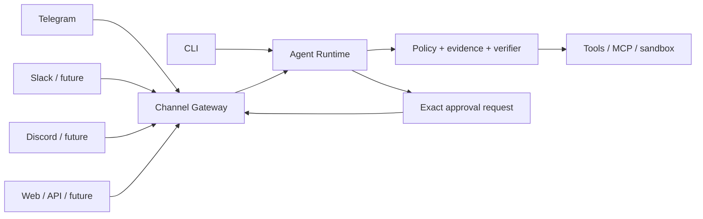

# Communication channels

The harness treats Telegram, Slack, Discord, a web UI, a CLI, or a future mobile app as **untrusted transports around one governed runtime**. A channel never receives extra tool permissions and cannot bypass evidence, capability, verification, execution-ledger, or human-approval gates.

## Architecture



The transport-neutral layer lives in `adaptive_harness.channels.base`. It maps a `(channel, conversation, human)` identity to a durable `session_id` and converts runtime results to channel messages. Transport adapters only parse inbound events and render outbound messages/buttons.

## Telegram adapter

The reference Telegram adapter uses the official Bot API through the existing `httpx` dependency. It uses long polling so a private VPS deployment does not need a public webhook endpoint.

Security defaults:

- `allowed_user_ids` is mandatory and empty means deny everyone.
- group/supergroup use is disabled unless `allow_group_chats: true` is explicitly set.
- `allowed_chat_ids`, when present, adds another restriction rather than replacing user authorization.
- the bot token is read from an environment variable and is never stored in YAML.
- HTTP transport exceptions are sanitized so the Bot API token, which is part of the Bot API URL, is not printed accidentally.
- action approval is scoped to the exact channel session that created it.
- approval buttons carry only the approval UUID; the runtime re-fetches the stored exact payload and SHA-256 fingerprint before resume.
- Telegram update offsets are persisted in the trace SQLite store.
- if a process crashes while handling an update, the update may be delivered again; high-impact/non-idempotent tool effects remain protected by the runtime's execution ledger and exact approval machinery.

### Configuration

Add to `config/harness.yaml`:

```yaml
telegram:
  enabled: true
  token_env: TELEGRAM_BOT_TOKEN
  allowed_user_ids:
    - 123456789
  # Optional additional restriction. For a private chat this is normally your user/chat id.
  allowed_chat_ids: []
  allow_group_chats: false
  poll_timeout_seconds: 30
  max_steps: 40
  max_cost_usd: null
  profile: null
```

Set the secret outside the repository:

```bash
export TELEGRAM_BOT_TOKEN='123456:replace-me'
adaptive-harness telegram -c config/harness.yaml
```

Create the bot with BotFather, keep the token out of Git, and determine the Telegram numeric user ID you want to allow before enabling the service. Do not deploy a general-purpose tool-using agent as a public Telegram bot.

### Interaction model

Send a normal message to create/continue the durable session for that Telegram user and chat. When the runtime reaches a high-impact action, it returns an exact approval request. Telegram renders:

- action summary;
- action type;
- exact action fingerprint;
- exact stored payload;
- **Approve** and **Reject** inline buttons.

A click does not directly execute the action. It records the human decision and calls `AgentRuntime.resume()`, where the fingerprint is checked again and blind verification is re-run when configured.

## Adding another channel

A new adapter should only need to implement four concerns:

1. authenticate/authorize the human and conversation;
2. construct `ChannelPrincipal` + `InboundMessage`;
3. pass messages/approval decisions through `AgentChannelGateway`;
4. render `OutboundMessage` objects using the transport's native UX.

The channel adapter must **not** invoke tools directly, modify approval rows directly except through the gateway, or alter model/system prompts to grant more permissions.

## Production extensions

The next useful channel work is not adding every messenger at once. Prioritize:

1. Telegram service unit / container healthcheck;
2. proactive notifications for maintenance proposals, scheduled jobs, and long-running task milestones;
3. attachment ingestion with MIME/size scanning and provenance tagging;
4. webhook mode behind a hardened HTTPS reverse proxy if long polling is no longer sufficient;
5. Slack/Discord adapters reusing the same gateway;
6. a web control plane for reviewing large self-improvement diffs that are awkward to inspect safely in chat.
